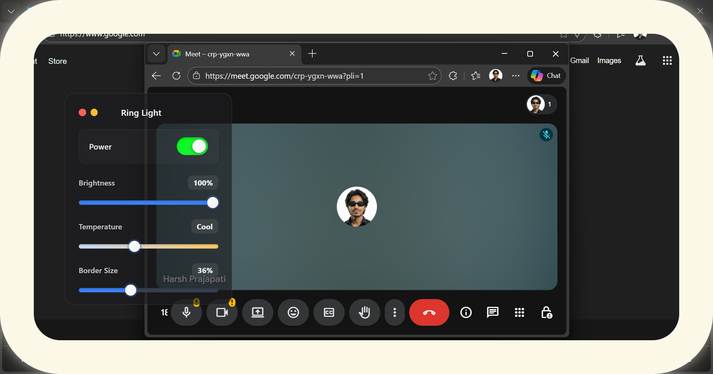

# Ring Light for Windows




A lightweight Electron-based Windows app that replicates the macOS "ring light" feature to improve your lighting on video calls. Built with HTML, CSS, and JavaScript.

- Works across Zoom, Google Meet, Microsoft Teams, Discord, and more
- Always-on-top visual light overlay near your webcam feed
- Privacy-friendly — runs entirely on your device

## Features

- Adjustable brightness, size, and color temperature (warm ↔ cool)
- Drag to position the light anywhere on the screen
- Always-on-top toggle to keep the light visible over call windows
- Quick show/hide toggle
- Lightweight, keyboard-friendly design

Planned:
- Chrome extension for browser-based meetings (Meet, Zoom Web, Teams Web)
- Multi-monitor support and smart positioning
- Auto-hide while screen sharing
- App-specific profiles (Zoom/Teams/Meet)
- Startup on boot and system tray controls
- Keyboard shortcuts for quick control

## Why

Good lighting dramatically improves video call quality. This app adds a soft ring/softbox-style light overlay near your webcam feed, so your face is evenly lit without needing extra hardware.

## Tech Stack

- Electron (Windows desktop)
- HTML, CSS, JavaScript (UI and controls)

## Installation (Development)

Prerequisites:
- Node.js 18+ and npm/pnpm
- Git

Steps:
```bash
# Clone the repository
git clone https://github.com/arreharsh/ring-light-windows.git

# Navigate to project directory
cd ring-light-windows

# Install dependencies
npm install
# or
pnpm install

# Start the app in development
npm start

# Optional: build/pack the app (depends on configured builder)
# If electron-builder or forge is configured, try:
npm run build
# or
npm run make
```

If you need a packaged build for Windows, open an Issue and we’ll provide a release.

## Usage

1. Launch the app.
2. Adjust brightness, size, and color temperature using the controls.
3. Drag the ring light to a suitable position near your webcam preview.
4. Enable "Always on top" to keep the light overlay visible during calls.
5. Use the quick toggle to show/hide the light when not needed.

Works great with:
- Zoom
- Google Meet
- Microsoft Teams
- Discord
- Most other video calling apps

## Privacy

- No data leaves your machine — the app runs entirely locally.
- The overlay is purely visual and does not access your camera or microphone.

## Roadmap

- Chrome extension for browser meetings
- Per-app profiles and automatic activation
- Auto-hide on screen share
- Multi-monitor placement
- System tray + startup on boot
- Keyboard shortcuts

## Contributing

Contributions are welcome!
- Report bugs
- Suggest features
- Submit pull requests

Please open an Issue first for major changes to discuss your proposal.

# Note 

## ⚠ Windows SmartScreen Notice

```
This app is not yet digitally signed.
Windows may show a “not commonly downloaded” warning.

Click **More info → Run anyway** to continue.
The app is safe and runs entirely locally.


